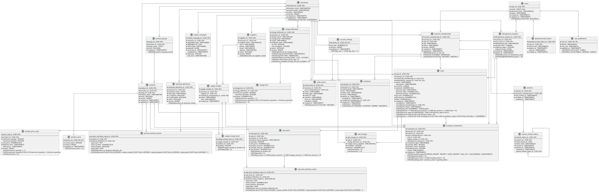

# Diagrama ERD de Agilora

El modelo de datos de Agilora está normalizado hasta la tercera forma normal (3FN).

La fuente editable del diagrama es el archivo [diagrama-erd-agilora.puml](./diagrama-erd-agilora.puml).

El archivo PlantUML representa las entidades, atributos, claves primarias, claves foráneas, restricciones y relaciones necesarias para el SaaS multiempresa.
